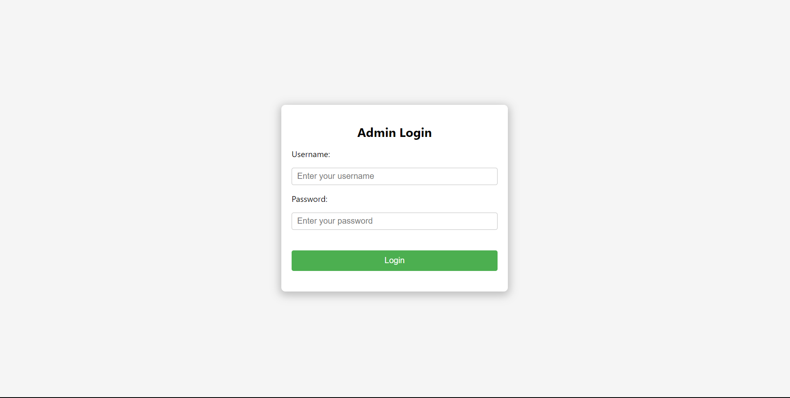
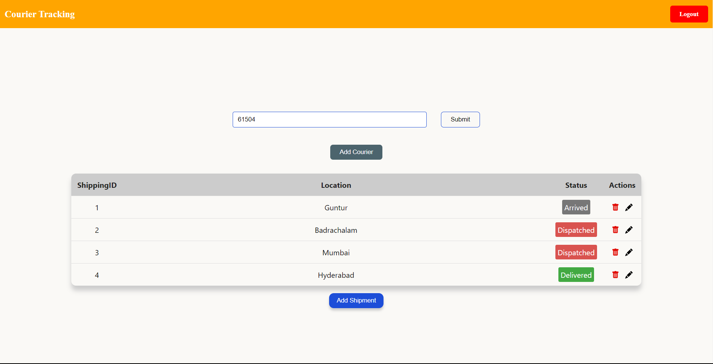
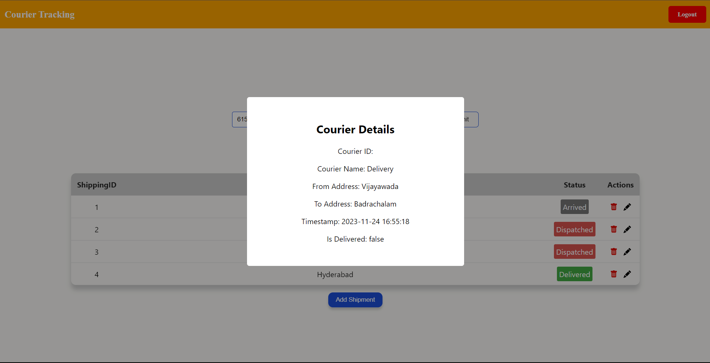

# Courier Tracking

## Description
This project is a courier tracking system that allows users to track their packages and monitor their delivery status.

## Features
- User registration and login
- Package tracking by courier ID
- Real-time updates on package status
- User-friendly interface

## Installation
1. Clone the repository: `git clone https://github.com/your-username/courier-tracking.git`
2. Install dependencies: `npm install`
3. Start the application: `npm start`

## Usage
1. log in with your credentials.
2. Enter the courier ID of your package to track its status.
3. View real-time updates on the package's location.

## Login Credentials
To log in, use the following credentials:
- Username: thirumala
- Password: abc123

## Courier ID
To track a package, use the following courier ID:
- Courier ID: [61502,61503,61504,76084]

## Technologies Used
- Frontend: ReactJs
- Backend: NodeJs,ExpressJs
- Database: SQLite

## Login page

## Home Page 

 

## courier Details 

